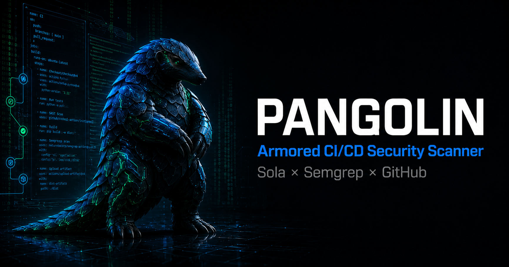

<div align="center">



# Pangolin

**Armored CI/CD Pipeline Security Scanner** — powered by Sola Security MCP + LLM deep analysis + Semgrep cross-validation.

<br>

### [$ecur1ty H4ckath0n](https://www.boring.security) — Community Voting Open!

We're competing in the **$ecur1ty H4ckath0n** by [Sola / Boring Security](https://www.boring.security).

**If you find this project useful or interesting, please vote for us!**

### [**Vote for Pangolin**](https://www.boring.security/?sort=votes&s=c6afac19-a7c7-4098-96a3-57a9bd93fe49)

Voting is open until **June 30, 2026**. Every vote counts — thank you for your support!

</div>

---

Pangolin scans your GitHub workflows for CI/CD vulnerabilities, reasons through attack chains with LLM, generates proof-of-concept files, and auto-fixes findings with GitHub PRs.

## Features

- **Regex Pattern Engine** — 17 battle-tested patterns scan all workflows in 0.1s
- **LLM Deep Analysis** — GPT-5.5 reasons through 5 attack pattern lenses, filters false positives
- **Semgrep Cross-Validation** — Maps Pangolin patterns to 2,900+ Semgrep rules via CWE
- **Auto-Fix PR** — One command generates a fix and opens a GitHub pull request
- **PoC Generation** — Automatic proof-of-concept exploit files for confirmed findings
- **HTML Report** — Dark-themed interactive report with severity badges and PoC downloads
- **Slack Integration** — Scan alerts, deep analysis results, and fix PR notifications
- **Posture Assessment** — Branch protection, review requirements, security policy checks

## Quick Start

```bash
git clone https://github.com/cyh7789/pangolin.git
cd pangolin
pip install httpx
```

### 1. Set up credentials

Copy `.env.example` to `.env` and fill in:

```bash
cp .env.example .env
```

```env
# Sola Security MCP (get from app.sola.security → Project → Data Sources)
SOLA_CLIENT_ID=your-client-id
SOLA_CLIENT_SECRET=your-client-secret

# Slack (optional — for notifications)
SLACK_WEBHOOK_URL=https://hooks.slack.com/services/...
SLACK_BOT_TOKEN=xoxb-...
SLACK_CHANNEL_ID=C...
```

### 2. Set up Sola MCP

Pangolin reads data from Sola via MCP (Model Context Protocol). You need:

1. **Create a Sola account** at [app.sola.security](https://app.sola.security)
2. **Connect GitHub** as a data source (Settings → Integrations → GitHub)
3. **Connect Semgrep** (optional, for cross-validation)
4. **Create a project** and add your data sources
5. **Get MCP credentials**: Project → Settings → MCP → Generate OAuth credentials
6. **Configure MCP** in your Claude Code / AI tool:

```json
{
  "mcpServers": {
    "sola": {
      "command": "npx",
      "args": ["-y", "@anthropic-ai/mcp-remote", "https://mcp.sola.security/sse"],
      "env": {
        "OAUTH_CLIENT_ID": "your-client-id",
        "OAUTH_CLIENT_SECRET": "your-client-secret"
      }
    }
  }
}
```

### 3. Export Sola data

From Claude Code (or any MCP-connected tool), run the SQL queries to export data:

```bash
python -m pangolin.cli sola-export
```

This prints the SQL queries. Run them via MCP `execute_sql` and save results to `output/sola-data.json`.

### 4. Run scan

```bash
# Quick regex scan
python -m pangolin.cli sola-scan --input output/sola-data.json

# Full deep analysis + Slack notification
python -m pangolin.cli sola-scan --input output/sola-data.json --deep --notify

# List fixable findings
python -m pangolin.cli fix --list

# Auto-fix a finding (opens GitHub PR)
python -m pangolin.cli fix --finding 1 --notify
```

### 5. Set up Codex for LLM analysis (--deep mode)

The `--deep` flag uses OpenAI Codex for attack chain reasoning. You need:

1. Log in to Codex: `codex login`
2. Auth is stored at `~/.codex/auth.json`
3. Model used: `gpt-5.5` with `reasoning.effort: high`

### 6. Set up GitHub token (for auto-fix PRs)

The `fix` command needs GitHub API access to create branches and PRs:

```bash
# Option A: Use gh CLI (recommended)
gh auth login

# Option B: Set token directly
export GITHUB_TOKEN=ghp_...
```

## Architecture

```
Sola MCP ─── GitHub (37 tables) ──┐
         └── Semgrep (2,932 rules)─┤
                                   ▼
                     ┌─────────────────────────┐
                     │  Stage 1: Regex Engine   │ 17 patterns, 0.1s
                     │  Stage 2: LLM Analysis   │ GPT-5.5, 5 attack lenses
                     │  Stage 3: Posture + Semgrep │ CWE cross-validation
                     │  Stage 4: Reports + PoC  │ HTML + 29 exploit files
                     │  Stage 5: Slack + PR     │ Notifications + auto-fix
                     └─────────────────────────┘
```

## Scan Patterns

| Category | Count | Examples |
|----------|-------|---------|
| CI/CD | 8 | Script injection, pull_request_target, unpinned actions, excessive permissions |
| Supply Chain | 4 | curl\|sh, no-lockfile install, unpinned Docker, no-provenance publish |
| Code | 5 | Command injection, SSRF, unsafe deserialization, hardcoded secrets, path traversal |

## Built For

[$ecur1ty H4ckath0n](https://www.boring.security) by Sola — making security less annoying.

## License

MIT
